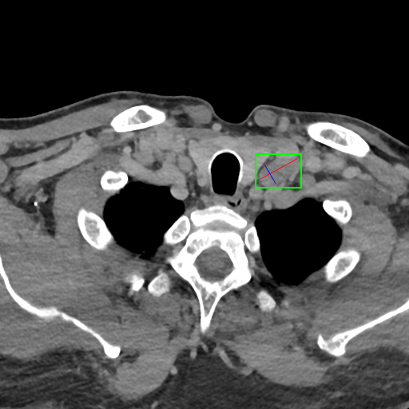
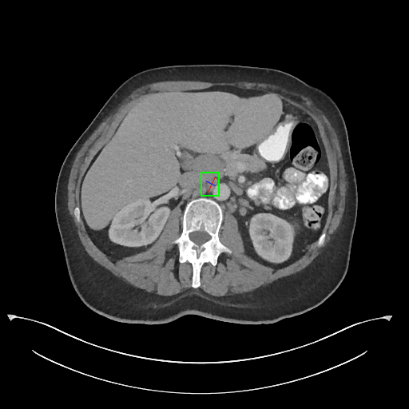

# RetinaNet-for-CT-Lesion-Detection

  
   

## Overview
Detection and localization of abnormalities in Computed Tomography (CT)
scans is a critical routine task for radiologists. Accurate, automated detection
of suspicious regions could greatly support screening, diagnosis and monitoring
of disease progression. Most previous work focuses on a specific type of lesion
within a relatively constrained (anatomical) context, such as lymph nodes, lung
nodules and brain microbleeds. 

## Dataset
[DeepLesion dataset](https://www.spiedigitallibrary.org/journals/journal-of-medical-imaging/volume-5/issue-03/036501/DeepLesion--automated-mining-of-large-scale-lesion-annotations-and/10.1117/1.JMI.5.3.036501.full?SSO=1) consists of 32,120 axial CT slices from 10,594 studies of 4,427 patients There are 1~2 lesions in each slice, adding up to 32,735 lesions altogether.

## RetinaNet
The backbone of our approach is a [RetinaNet](https://arxiv.org/pdf/1708.02002.pdf), a recent one-stage method
for object detection. The use of a focal loss addresses the common problem of
class imbalance in detection tasks. The feature pyramids and lateral connections
with a top-down architecture are adopted for detecting objects at different
scales. This is an important difference with methods such as 3DCE, since the feature pyramids can effectively capture information about lesions of varying
sizes including very small ones.

